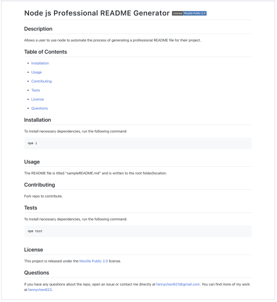
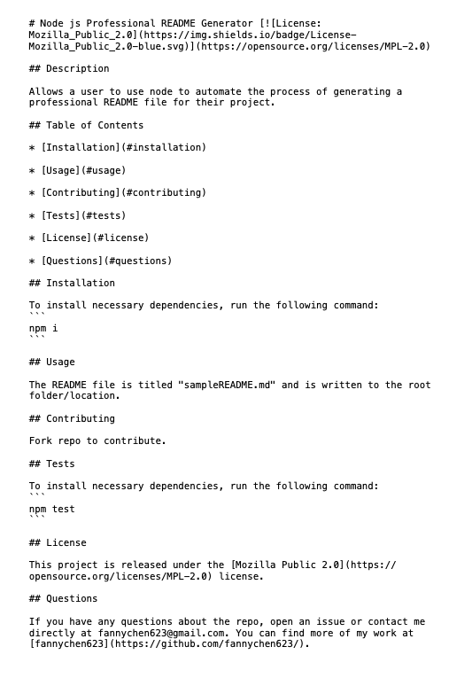

# Module 09 Challenge - Node.js: Professional README Generator

>**Application Video:** [Professional README Generator](https://drive.google.com/file/d/1wnPgtGMqW0F1YCBkTD9YU0YcC7tyHBsO/view)
>
>**View:** [Description](#description) / [Application Details](#application-details) / [Application Sample README File](#application-sample-file)
>
>**Application Preview:**
>
>
> 
>
> 

## **DESCRIPTION**
> Topic Assessed: **Node.js** - **package.json, npm packages (inquirer, fs), template literals, module.exports, etc.**
### **My Task**
*Professional README Generator* allows a user to use node to automate the process of generating a professional README file for their project.
> Modify existing starter code. 
>
> Install dependencies to run the application.
> 
> Use inquirer to ask a series of prompts to collect data.
> 
> Create a template for the README file with template literals of collected data.
> 
> Create module to render license badge and link if applicable.
> 
> Use node fs to write/create README file.
> 
## User Story
```
AS A developer
I WANT a README generator
SO THAT I can quickly create a professional README for a new project
```
## Acceptance Criteria

```
GIVEN a command-line application that accepts user input
WHEN I am prompted for information about my application repository
THEN a high-quality, professional README.md is generated with the title of my project and sections entitled Description, Table of Contents, Installation, Usage, License, Contributing, Tests, and Questions
WHEN I enter my project title
THEN this is displayed as the title of the README
WHEN I enter a description, installation instructions, usage information, contribution guidelines, and test instructions
THEN this information is added to the sections of the README entitled Description, Installation, Usage, Contributing, and Tests
WHEN I choose a license for my application from a list of options
THEN a badge for that license is added near the top of the README and a notice is added to the section of the README entitled License that explains which license the application is covered under
WHEN I enter my GitHub username
THEN this is added to the section of the README entitled Questions, with a link to my GitHub profile
WHEN I enter my email address
THEN this is added to the section of the README entitled Questions, with instructions on how to reach me with additional questions
WHEN I click on the links in the Table of Contents
THEN I am taken to the corresponding section of the README
```

## **APPLICATION DETAILS**

### index.js Information
* **require**: Define packages needed for the application.
  * `inquirer` and `fs`.
* **generateREADME**: Template of the README file with multiple data parameters.
  * Include Table of Contents with linked sections.
	* Sections: `Installation`, `Usage`, `Contributing`, `Tests`, `License`, `Questions`.
  * Template literals of parameters.
  	* From inquirer data: `username`, `email`, `title`, `description`, `installation`, `usage`, `contribution`, `tests`.
	* From license markdown module: `licenseMarkdown`, `licenseInfo`.
* **inquirer**: Contains series of prompts/questions to collect user input.
  * prompt: 
	* License is in list type (limits selection to 1 option).
	* Installation and Tests have default entries.
  * then(data):
	* Define the local `generateMarkdown` package.
	* Check that a license is selected.
	* Run the modules exported from the package to generate license badge, link, and section information.
	* With the parameters `data`, `licenseMarkdown`, and `licenseInfo`, populate the README template.
	* Use fs to `writeFile` to generate the README file.
	  * Log error message if applicable, otherwise, log success completion message. 

### generateMarkdown.js Information
* **licenseList**: Define the list of common license.
  * Define the object's `name`, `type`, and `indentifier`.
  * The type is used to determine the link prefix of the license information site.
  * The identifier is the SPDX short identifier corresponding to the license based on the site.
* **renderLicenseBadge**: Create the link string of the license badge.
  * Used [Shields.io](https://shields.io/) to create the badges.
    * Reference Code: [Markdown License badges](https://gist.github.com/lukas-h/2a5d00690736b4c3a7ba)
  * Modify the license name so that it's appropriate for the badge link format.
	* Replace `-` with `--` for dash.
	* Replace `_` with `__` for underscore. (not applicable for defined list)
	* Replace ` ` with `_` for space.
  * Return the badge link with template literal of license name.
  * Return empty string if 'None' was selected for license.
* **renderLicenseLink**: Create the link to the license's info site.
  * License Types: [OpenSource](https://opensource.org/licenses/) / [Creative Commons](https://creativecommons.org/)
  * Determine the license type based on the license name to select the link prefix.
  * Identify the license identifier used in the link.
  * Return empty string if 'None' was selected for license.
* **module.exports**: Export the two functions in the package to be used in other files.

### package.json Information
* **package**: Define the dependencies/packages used in the application.
  * Dependencies: `inquirer`, version 8.2.4

## **APPLICATION SAMPLE FILE**
### Sample README file
>
>